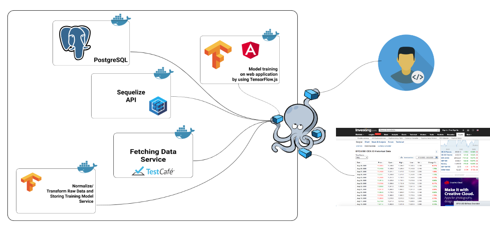

# Stock Forecasting

## Introduction

Coming soon...



## Requirements

 - [x] [Nodejs](https://nodejs.org/en/)
 - [x] [PostgreSQL](https://www.postgresql.org/)
 - [x] [TestCafe](https://devexpress.github.io/testcafe/) (automate end-to-end web testing)
 - [ ] [Docker](https://www.docker.com/get-started) or [Docker compose](https://docs.docker.com/compose/) (optional)
 - [ ] [DBeaver](https://dbeaver.io/) (optional for SQL database IDE)

## Micro-services

Stock forecasting service contains 5 micro-services, including :

**Backend**

 - PostgreSQL
 - Fetcher (web scrapping)
 - Normalize/Transform data
 - Sequelize (Database API)

**Frontend**

 - Model training on web application (TensorFlow.js)

## Before start

In some parts require you to config something, please read more detail in each service below :

 - Fetcher (web scrapping), [read](./fetcher/README.md).
 - Normalize/Transform data, [read](./normalize/README.md).
 - Sequelize (Database API), [read](./sequelize/README.md).

## Installation & Start services

I provide 2-styles :

 - Dockerize
 - Undockerize

### Dockerize

```bash
# Create PostgreSQL's database volume
$ mkdir -p pgdata

# Create Docker network for our micro-service.
# In this case our network name is "stock-forecasting"
$ (docker network create stock-forecasting || :)

# Stop previous running services
$ docker-compose -f docker-compose.yml stop && \
docker-compose -f docker-compose.yml down -v

# Start all services with detach
$ docker-compose -f docker-compose.yml up --build -d

# Check logs
$ docker-compose logs -f
```

Alternative

```bash
$ sh run.sh
```

### Undockerize

#### Preparing PostgreSQL

You need to install `PostgreSQL` first, then create database and table to record the data :

```sql
SELECT 'CREATE DATABASE stock' 
WHERE NOT EXISTS (SELECT * FROM pg_database WHERE datname = 'stock');

CREATE TABLE IF NOT EXISTS stock_daily (
    on_date varchar(20) NOT NULL,
    stock_name varchar(10) NOT NULL,
    price_close real NOT NULL DEFAULT 0.0,
    price_open real NOT NULL DEFAULT 0.0,
    price_high real NOT NULL DEFAULT 0.0,
    price_low real NOT NULL DEFAULT 0.0,
    volume varchar(15) NOT NULL
);
CREATE UNIQUE INDEX idx_stock_daily ON stock_daily (on_date, stock_name);

CREATE TABLE IF NOT EXISTS users (
    id SERIAL PRIMARY KEY,
    uid varchar(50) NOT NULL, 
    email varchar(255) NOT NULL,
    first_name varchar(255) NOT NULL,
    last_name varchar(255) NOT NULL,
    address1 varchar(255) NOT NULL,
    address2 varchar(255) NOT NULL,
    address3 varchar(255) NOT NULL,
    phone varchar(255) NOT NULL,
    role varchar(50) NOT NULL,
    verified integer NOT NULL,
    created_date varchar(20) NOT NULL,
    updated_date varchar(20) NOT NULL
);
CREATE UNIQUE INDEX idx_users ON users (uid);

CREATE TABLE IF NOT EXISTS prediction (
    pid SERIAL PRIMARY KEY,
    stock_name varchar(10) NOT NULL,
    predict_on varchar(20) NOT NULL,
    predict_price real NOT NULL DEFAULT 0.0,
    test_send_order varchar(5) NOT NULL,
    target_date varchar(20) NOT NULL,
    real_close_price real NOT NULL DEFAULT 0.0,
    result integer NOT NULL DEFAULT -1,
    created_date varchar(20) NOT NULL,
    updated_date varchar(20) NOT NULL
);
```

After prepared `PostgreSQL`, please focus on 4-services below :

#### Model training on web application (./app)

```bash
# Install dependencies
$ npm i

# Start service
$ npm run start
```

#### Web Scrapping (./fetcher)

```bash
# Install dependencies
$ npm i

# Start service
$ npm run start
```

#### Normalize/Transform Data (./normalize)

```bash
# Install dependencies
$ npm i

# Start service
$ npm run start
```

#### Database API (./sequelize)

```bash
# Install dependencies
$ npm i

# Start service
$ npm run dev
```

## Usage

I didn't provide API gateway but you can calling API of each service via `Postman` :

### APIs

#### Merge Raw Data

Merge current raw data with the previous data.

```bash
$ curl --location --request POST 'http://localhost:3000/mergecsv' \
--header 'Content-Type: application/json' \
--data-raw '{
	"file_contain_name":"BTC_USD CEX.IO Historical Data"
}'
```

#### Mapping merged data to JSON template

Transform data to our template.

```bash
$ curl --location --request POST 'http://localhost:3000/template-mapping' \
--header 'Content-Type: application/json' \
--data-raw '{
	"fname": "BTC_USD CEX.IO Historical Dataall"
}'
```

#### Fetching Historical Data

```bash
$ curl --location --request POST 'http://127.0.0.1:3001/data/historical' \
--header 'Content-Type: application/json' \
--data-raw '{
	"from":"01/01/2019",
	"to":"07/01/2020"
}'
```

#### Insert Stock Data to Database

```bash
$ curl --location --request POST 'http://127.0.0.1:3002/stock/btc_usd_cexio' \
--header 'Content-Type: application/json' \
--data-raw '{
	"method":"add",
	"data":[{
		"dt":"Nov 13, 2017",
	    "price": "6,775.0",
	    "open": "6,100.3",
	    "high": "7,040.0",
	    "low": "6,039.2",
	    "vol": "4.21K"
	}]
}'
```

#### Get Last Record

```bash
$ curl --location --request POST 'http://127.0.0.1:3002/lastRecord/btc_usd_cexio'
```

#### Get Stock

```bash
$ curl --location --request POST 'http://localhost:3002/stock/btc_usd_cexio' \
--header 'Content-Type: application/json' \
--data-raw '{
	"method": "get",
	"condition": {
	},
	"period": {
		"field":"dt",
		"from":"2018-02-01",
		"to":"2019-12-22"
	},
	"options": { 
		"order": [ ["dt", "DESC"] ]
	} 
}'
```

## Contributing

Coming soon...

## License

MIT