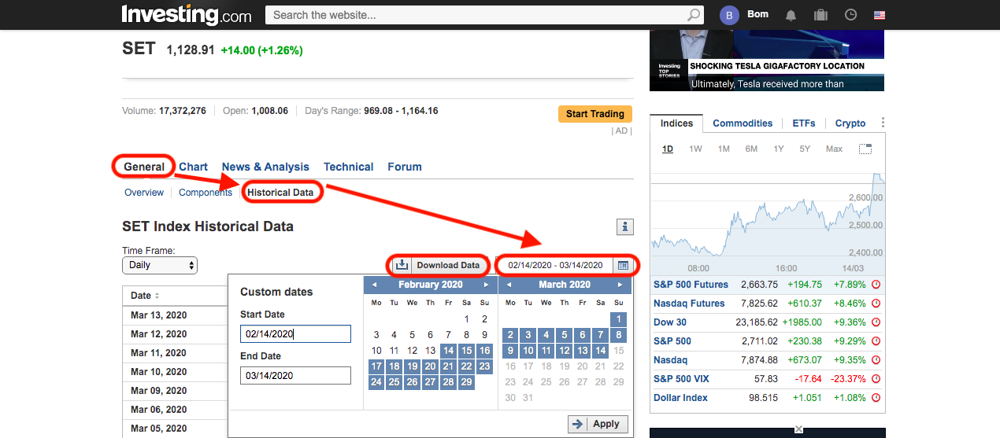

# Normalize service

## Rawdata

It came from [Investing.com](https://www.investing.com/) by focusing on historical data.
You can download via target stock name and then :

 - Go to `General` -> `Historical Data`
 - Select from-to(data range) date/time
 - Press `Download Data` button

ex. https://www.investing.com/indices/thailand-set-historical-data

**IMPORTANT** :  They allow user to download maximum data range around 10 years. In case you need more data, you need to load more than one times.